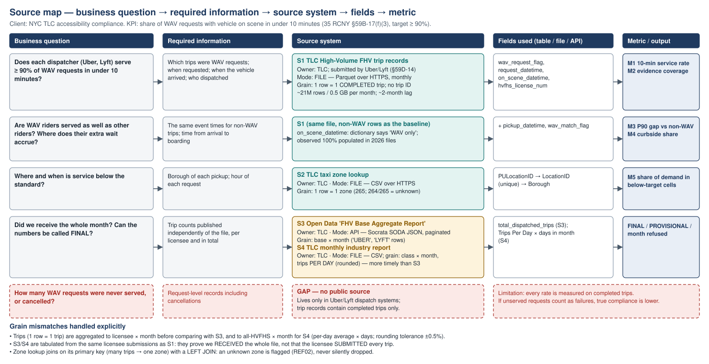
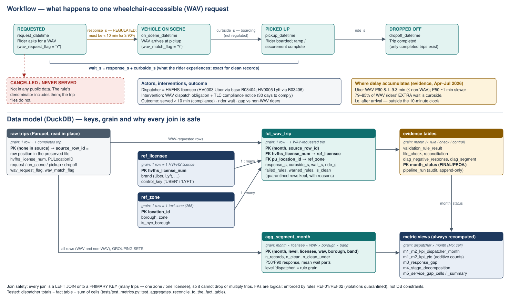
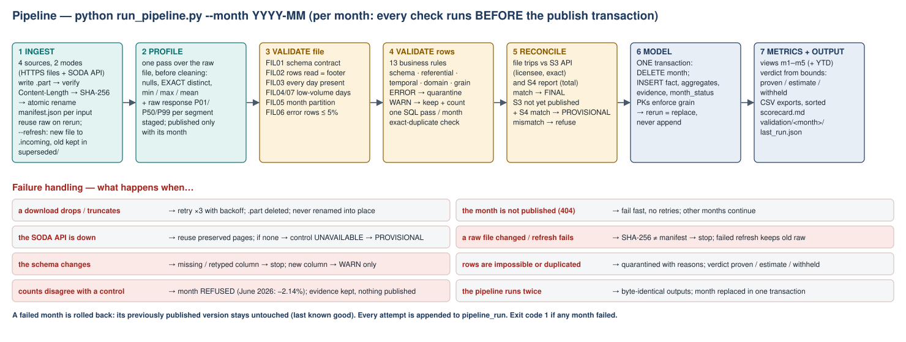

# WAV Service Scorecard — can TLC trust the wheelchair-accessible 10-minute standard numbers?

**FDE Data Foundations assignment · Track B (NYC TLC), scoped to one regulated operational KPI.**

A small, repeatable pipeline that turns ~21 million monthly NYC ride-hail trip records into a **validated,
reconciled monthly scorecard** for the TLC rule that wheelchair users must get a vehicle within 10 minutes.
It checks completeness against two control totals and quarantines impossible records. It also refuses to
report a KPI the data cannot support.

> **Headline (Apr–Jul 2026, real data):** Uber meets the standard: **94.3%** of validated WAV requests served in
> under 10 min across the three published months. That is *proven* for April and an *estimate* for May and July,
> whose bounds straddle 90%. **Lyft's compliance cannot be determined from public data.** 58–61% of its WAV
> records have the vehicle "arriving" before the rider requested it (its raw median response is **−6.4 min**).
> An unvalidated dashboard would report Lyft as compliant (92.7–94.1%). Silently dropping the bad rows would
> report it as non-compliant (81.0–85.2%). Neither number is trustworthy, so the pipeline withholds it and flags
> a data-correction request.

| Where to look | What it shows |
|---|---|
| [`outputs/scorecard.md`](outputs/scorecard.md) | The evidence table: retrieval status, M1–M5, diagnosis, data quality (generated) |
| [`diagrams/`](diagrams/) | Source map, workflow + data model, pipeline flow |
| [`docs/data_quality_findings.md`](docs/data_quality_findings.md) | Every quality issue: evidence → impact → decision → handling → limitation |
| [`docs/judgement_call.md`](docs/judgement_call.md) | The FDE judgement call explained in the demo |
| [`docs/rubric_map.md`](docs/rubric_map.md) | Where the evidence for each grading dimension lives |
| [`submission/FDE_WAV_Evidence_Sheet.pdf`](submission/FDE_WAV_Evidence_Sheet.pdf) | 2-page evidence sheet |

---

## 1. Problem

NYC's Taxi & Limousine Commission (TLC) requires every *Accessible Vehicle dispatcher* (in practice Uber and Lyft) to
**serve at least 90% of wheelchair-accessible-vehicle (WAV) requests in under 10 minutes**. The rule is
35 RCNY §59B-17(f)(3), tightened on 29 Jan 2025 and enforced per calendar year from April 2025. A dispatcher
that misses it gets a notice and 30 days to comply.

**Problem hypothesis.** TLC cannot currently answer, month by month and with confidence, *"Is each dispatcher
meeting the 10-minute WAV standard, and where are wheelchair users waiting longest?"* There are two reasons:

1. **The evidence is fragmented.** It sits in a 0.5 GB trip file per month, a zone reference file and two
   separately published control reports.
2. **The trip timestamps contain systematic errors that silently inflate compliance.**

The consequences are (a) a dispatcher can look compliant when the data cannot support that conclusion, and
(b) WAV shortfalls in specific boroughs and hours hide inside a citywide average. This project builds a
validated monthly pipeline so that TLC's accessibility compliance staff can decide **whether to open a
compliance review or a data-correction request, and where to push WAV supply.**

## 2. Users / stakeholders

| Stakeholder | Uses the output to… |
|---|---|
| **TLC accessibility / compliance staff** (primary; owners of §59B-17) | decide on compliance notices, data-correction requests, WAV supply programmes |
| TLC data & technology team (owner of trip-record submissions) | act on data-quality findings (timestamp semantics, missing submissions) |
| Uber / Lyft WAV operations teams | see which borough × time windows fall below the standard |
| Wheelchair users and disability advocates (indirectly, via TLC reporting) | trust that published WAV performance is real |

## 3. Project KPI

**WAV 10-minute service rate** = share of completed WAV-requested trips where the vehicle was **on scene less
than 600 s after the request**, per dispatcher per month. **Target ≥ 90%.** TLC measures WAV wait as the time
until the vehicle "arrived at the customer's location". That is `on_scene_datetime − request_datetime`, not
pickup (TLC FY23 FHV Accessibility Report, p. 6).

## 4. Why it matters

- It is a **regulated, enforceable** service standard for a vulnerable rider group. The dispatchers submit
  their own data, so a wrong number has legal and equity consequences.
- TLC's own FY23 accessibility report lists **"Add FHV WAV service metrics to the TLC Dashboard"** as
  recommendation #1. This pipeline is that capability, built to be trustworthy.
- The 2025 rule package made HVFHS report **on-scene time for all trips** *"so that TLC can better compare WAV
  and non-WAV wait times"*. This project does exactly that comparison (M3, M4).

## 5. Source overview

| # | Source | Owner | Retrieval mode | Grain | Why it is necessary |
|---|---|---|---|---|---|
| S1 | HVFHV trip records, `fhvhv_tripdata_YYYY-MM.parquet` | TLC (submitted by Uber/Lyft under §59D-14) | **File** — Parquet over HTTPS (CloudFront) | 1 row = 1 **completed** trip; **no trip ID** | The only source of request / on-scene / pickup timestamps and the WAV flag |
| S2 | Taxi zone lookup, `taxi_zone_lookup.csv` | TLC | **File** — CSV over HTTPS | 1 row = 1 zone (265) | Maps pickup zone → borough for *where* (M5) |
| S3 | "FHV Base Aggregate Report" (Open Data `2v9c-2k7f`) | TLC, published on NYC Open Data | **API** — Socrata SODA JSON, paginated | base × month (Uber/Lyft appear as `UBER`/`LYFT`) | **Independent control total** per licensee: proves the file is complete |
| S4 | TLC monthly industry report, `data_reports_monthly.csv` | TLC | **File** — CSV over HTTPS | licence class × month, trips **per day** (rounded) | **Timely fallback control**: S3 lags ~2 months, S4 does not |

Reference documents (cited, not ingested): the TLC HVFHS data dictionary (18 Mar 2025), the Notice of
Promulgation of the WAV wait-time amendment (adopted 29 Jan 2025), and the TLC FY23 FHV Accessibility Report.
See [References](#references).

## 6. Source map



Per-source detail (key fields, refresh, expected completeness, known quality problems, join keys, gaps) is in
[`docs/source_map.md`](docs/source_map.md). **Important gap:** requests that were never served or were
cancelled appear in *no* public source. Every rate here is therefore measured on completed trips.

## 7–8. Workflow and data model



- **Entities:** dispatcher (HVFHS licensee → dispatching base), trip, pickup zone → borough. The vehicle is
  observed only via `wav_match_flag`; there is no vehicle ID.
- **Events:** REQUESTED → VEHICLE ON SCENE → PICKED UP → DROPPED OFF. **Unobserved:** cancelled or never served.
- **Stages:** `response_s` (regulated), `curbside_s` (boarding/securement), `ride_s`. Rider wait =
  response + curbside, exactly.
- **Intervention / outcome:** the dispatcher's WAV obligation and TLC compliance notices → served in under
  10 min, rider wait, and the gap versus non-WAV riders.

Tables (DuckDB, [`sql/00_schema.sql`](sql/00_schema.sql)):

| Table | Grain / primary key | Role |
|---|---|---|
| `ref_licensee` | PK `hvfhs_license_num` | dispatcher reference ([`config/licensees.csv`](config/licensees.csv)) |
| `ref_zone` | PK `location_id` | zone → borough |
| `fct_wav_trip` | PK `(month, source_row_id)` = one WAV-requested trip; logical FKs → licensee, zone (enforced by rules REF01/REF02, which quarantine violations; not declared as DB constraints, because the reference tables are fully refreshed each run) | trip-level fact incl. quarantined rows and reasons |
| `agg_segment_month` | PK `(month, level, licensee, wav, borough, band)` | all 21M trips aggregated at the rule's grain and at cell grain |
| `validation_rule_result`, `file_check`, `reconciliation`, `diag_negative_response`, `diag_segment` | month × rule / check / control / segment | validation and diagnostic evidence |
| `month_status`, `pipeline_run` | month; append-only runs | FINAL / PROVISIONAL status; audit trail |

**Grain and joins.** The source has no trip ID, so lineage uses the row's position in the preserved raw file
(`source_row_id`). Every join is a `LEFT JOIN` onto a reference table's primary key (many trips → one zone or
licensee), so it cannot drop or multiply trips; an unmatched key fails REF01/REF02 visibly. A test asserts
that dispatcher totals = fact rows = the sum of cells.

## 9. Retrieval methods and how completeness is proven

| Mode | Source | Completeness evidence (stored in `data/raw/**/manifest.json` and `outputs/validation/<month>/`) |
|---|---|---|
| File (HTTPS) | S1 trips | streamed to `.part`; bytes on the wire = `Content-Length`; SHA-256; atomic rename. Rows read by the validation scan = rows in the Parquet footer (FIL02). Every calendar day present (FIL03). Pickups inside the month (FIL05). |
| File (HTTPS) | S2 zones | schema contract; 265 rows, `LocationID` unique (ZON02) |
| API (SODA) | S3 control | server `count(*)` for the same `$where`, then pages ordered by a total key (`base_license_number, :id`) until retrieved = expected. The raw JSON pages are preserved. |
| File (HTTPS) | S4 control | month row present; re-checked upstream when the cached copy predates the month |
| **Reconciliation** | S1 vs S3 / S4 | per-licensee trips vs S3 (±0.5%) → **FINAL**; S3 unpublished but total vs S4 matches → **PROVISIONAL**; any mismatch → **month refused** |

**Real results:**

| Month | Trip records | Uber vs S3 | Lyft vs S3 | All vs S4 | Status |
|---|---|---|---|---|---|
| 2026-04 | 20,995,953 | exact (0) | exact (0) | +63 (+0.0003%) | **FINAL** |
| 2026-05 | 22,125,744 | exact (0) | exact (0) | +114 (+0.0005%) | **FINAL** |
| 2026-06 | 20,775,868 | not yet published | not yet published | **−454,232 (−2.14%)** | **REFUSED** |
| 2026-07 | 20,921,249 | not yet published | not yet published | +62 (+0.0003%) | **PROVISIONAL** |

For June, FIL07 flags **Lyft on 8–10 June** (113.5–117.2K trips/day against a Lyft median of 187.7K). The
published daily series ([`outputs/validation/2026-06/daily_volume_by_licensee.csv`](outputs/validation/2026-06/daily_volume_by_licensee.csv))
shows Lyft stays low through 14 June (113.5–172.6K) while Uber is flat. Lyft's deficit on 8–14 June against the
median of the same weekday in the other June weeks is ≈ 489K, the same order as the 454K gap. Missing Lyft
submissions for that week is an *inference*; TLC has not confirmed it. The refused month's evidence (checks,
reconciliation, daily series, raw profile, `REFUSED.json`) is written to `outputs/validation/2026-06/`, and
nothing is published.

**Retrieval lesson found on real data:** nyc.gov serves S4 gzip-compressed, so `Content-Length` is the
*compressed* size. The first version compared it with decoded bytes and correctly refused the file. The fix
requests `Accept-Encoding: identity` (so the SHA-256 covers the file as published) and compares wire bytes
whenever a server compresses anyway. nyc.gov also returns 403 to non-browser user agents, so a standard browser
UA string is sent ([`config/pipeline.yaml`](config/pipeline.yaml)).

## 10. Validation

**Profile first:** `outputs/profile/<month>_trips_profile.csv` gives rows, null %, **exact** distinct counts,
min, max and mean of every raw column, before any cleaning. `outputs/metrics/dq_segment_profile.csv` gives the
raw response-time distribution (P01/P50/P99) per licensee × WAV segment, plus the record-path and airport
patterns. The profile is staged and only published together with its month, so a refused rerun cannot
overwrite a good month's evidence.

**Checks** (full generated list: [`outputs/validation_rules.md`](outputs/validation_rules.md)):

- **File level (FATAL):** schema contract, rows read = footer, day coverage, month partition, error-row share,
  reconciliation. **WARN:** low-volume days per file and per licensee.
- **Row level, 13 business rules**, one SQL pass over every record:
  - *schema* (SCH01–02); *referential* (REF01–03: licensee, zone, borough); *grain* (DOM04: exact
    duplicates, since there is no trip ID).
  - *temporal* (TMP01–04: month partition; request ≤ on-scene ≤ pickup < dropoff).
  - *domain* (DOM01 WAV request served by a WAV; DOM02 response > 60 min; DOM03 on-scene = pickup).
  - ERROR → quarantined with reasons. WARN → kept and counted.
- **Segment level (SEG01), the verdict logic:**
  - The bounds count every quarantined record first as a failure, then as a pass.
  - Both bounds on one side of 90% → **proven** MEETS / BELOW.
  - The bounds straddle 90% → the clean-record rate decides (**estimate**), but only if ≥ 90% of the records are
    clean. That is a policy line set equal to the standard's own 10% tolerance.
  - Otherwise → **NOT MEASURABLE**.

**Most important findings** (all in [`docs/data_quality_findings.md`](docs/data_quality_findings.md)):

| Issue | Evidence (Apr / May / Jul 2026) | Decision |
|---|---|---|
| Lyft WAV: vehicle "on scene" before the request | **60.0% / 61.4% / 58.0%** of Lyft WAV records; one base (B03406); every day; 1 s to 47 min "early"; raw median response **−5.8 to −6.4 min**; Lyft's WAV rows are its only rows with `originating_base_num` set (100% vs 0% of non-WAV), so they come from a separate record path | quarantine; **KPI withheld**; data-correction request |
| Uber: vehicle on scene before the request | 4.4% / 5.1% / 5.4% of WAV records, ~1.8% of non-WAV | quarantine; the measurable KPI is reported with bounds |
| …the Uber failures carry a **pre-booked-ride signature** | **99.95–100%** have request times on a whole minute (97–98% on a 5-minute mark), vs **~1.8%** of valid rows | cause *inferred*: `request_datetime` = booked pickup time and the driver arrived early. **Lyft WAV failures: 2.1–2.5% ≈ chance, so the cause is unknown** |
| `on_scene_datetime` documented as "Accessible Vehicles-only" | 0.00% null for all trips in all four months | trust the data over the dictionary (matches the 2025 rule); enables M3/M4 |
| On-scene = pickup to the second | 6.4% of Uber non-WAV trips (May); 21.9% at LGA/JFK pickups vs 5.8% elsewhere | WARN; kept; curbside medians carry the caveat |
| Long waits > 60 min | ≤ 0.005% of any segment | **kept as failures**, never dropped as "outliers" |
| Pickup outside the five boroughs (zones 1, 264, 265) | ≤ 0.02% of any segment | WARN; kept in the dispatcher KPI, excluded from borough cells |
| Exact duplicates, pickups outside the month, unknown licensee/zone | 0 in every month | checks pass; still enforced every run |

## 11. Metrics

Definitions with formula, unit, grain, filters, validation dependency and decision supported are in
[`docs/metrics.md`](docs/metrics.md). SQL: [`sql/40_metric_views.sql`](sql/40_metric_views.sql).

| # | Metric | Answers |
|---|---|---|
| **M1** | **WAV 10-min service rate** on clean records, with bounds [all quarantined fail, all pass] and a verdict that is *proven*, an *estimate*, or *withheld* | Is the dispatcher meeting the standard? |
| **M2** | **Evidence coverage**: share of WAV records with a trustworthy response time (policy line 90%) | Can we even say? |
| **M3** | **P90 response gap**, WAV − non-WAV, same dispatcher (P50s alongside) | Are wheelchair users reached as fast as everyone else? |
| **M4** | **Curbside share of extra wait**: how much of WAV riders' extra wait accrues *after* the vehicle arrives | Where does the delay accumulate? |
| **M5** | **Share of WAV demand in cells significantly below target** (borough × time band, n ≥ 100, 95% Wilson interval entirely below 90%) | Where and when to intervene? |

## 12–13. Pipeline architecture and failure handling



`INGEST → PROFILE → VALIDATE (file → rows → reconcile) → MODEL (one transaction) → METRICS → OUTPUT`

| What happens if… | Behaviour | Test |
|---|---|---|
| the pipeline runs twice | month replaced in one transaction (`DELETE`+`INSERT`, PKs enforce grain); **byte-identical outputs** (everything except `last_run.json`, which records the run itself) | `test_rerun_is_idempotent` |
| a download is truncated | retried ×3 with backoff; `.part` deleted, never renamed into place | `test_truncated_body_is_never_accepted` |
| the month is not published (404) | fail fast, no retries; other months continue | `test_not_published_month_fails_fast_without_retries`, `test_one_failing_month_does_not_block_another` |
| the SODA API fails / paginates short | reuse preserved pages, else control UNAVAILABLE → PROVISIONAL; short pagination is detected, never trusted | `test_soda_*` |
| a preserved raw file is modified | SHA-256 ≠ manifest → month stopped; last good version kept | `test_tampered_raw_file_is_detected`, `test_failed_rerun_keeps_last_known_good_month` |
| `--refresh` finds a new upstream version but the download fails | the new file goes to `.incoming` first; the old raw is superseded only after the new one is verified | `test_failed_refresh_keeps_the_preserved_raw` |
| the schema changes | missing/retyped column → stop; new column → WARN | `test_schema_drift_stops_the_month`, `test_new_uncontracted_column_only_warns` |
| a day is missing | month stopped (CompletenessError) | `test_missing_day_is_detected_as_incomplete_file` |
| counts disagree with a control | month refused (June 2026); its evidence goes to `outputs/validation/<month>/REFUSED.json` etc.; `--allow-unreconciled` publishes it as UNRECONCILED/PROVISIONAL | `test_control_total_mismatch_stops_publication`, `test_refused_month_leaves_evidence_but_publishes_nothing` |
| duplicates arrive | exact copies quarantined (first kept); PK on `(month, source_row_id)` | `test_exact_duplicate_keeps_first_copy_only` |
| a validation rule fails | row quarantined with rule IDs; verdict proven / estimate / withheld from the bounds | `test_each_bad_record_is_caught_by_its_rule` (12 cases), `test_decision_logic.py` (all five verdict states) |
| the network is unavailable | `--offline` rebuilds everything from preserved raw, identically | `test_offline_rebuild_from_preserved_raw_reproduces_outputs` |

Logging: console plus `logs/run_<id>.log`. Run manifest: `outputs/last_run.json` (inputs with SHA-256, every
check, reconciliation, statuses). Every attempt is appended to `pipeline_run`. Exit code 1 if any month failed.

**Reproducibility on real data:** rebuilding all four months (84 M trip records) from an empty warehouse, twice,
produced **byte-identical outputs**: every metric, validation and profile CSV, and `scorecard.md`. Only
`last_run.json` differs, because it records the run itself. Example logs, including the first runs that hit
the gzip and June issues, are in [`docs/evidence/`](docs/evidence/). CI runs the offline test suite on every push
([`.github/workflows/tests.yml`](.github/workflows/tests.yml)).

## 14. Setup

```bash
git clone https://github.com/rajasurya-rjs/fde_assigment_rajasurya_10086.git
cd fde_assigment_rajasurya_10086
python3 -m venv .venv && source .venv/bin/activate      # Python ≥ 3.11
pip install -r requirements.txt                          # duckdb, requests, PyYAML, pytest — nothing else
```

Each month downloads ~0.5 GB (raw trip files are not committed; their manifests are). A month processes in
about 40–80 s on a laptop (8 GB RAM; DuckDB memory capped at 4 GB).

## 15. Run

```bash
python run_pipeline.py --month 2026-04 --month 2026-05 --month 2026-06 --month 2026-07   # reproduces this repo's outputs
python run_pipeline.py --month 2026-05 --offline      # rebuild from preserved raw only (no network)
python run_pipeline.py --month 2026-05 --refresh      # re-check upstream; superseded raw versions are kept
python -m pytest                                      # 54 offline tests on a synthetic month (~45 s)
python diagrams/build_diagrams.py                     # regenerate the diagrams
```

Expected console summary (exit code 1 because June is refused — by design):

```
run 20260925T…Z: PARTIAL
  2026-04: PUBLISHED (RECONCILED, metrics FINAL)
  2026-05: PUBLISHED (RECONCILED, metrics FINAL)
  2026-06: FAILED (ReconciliationError: ALL: file 20,775,868 vs tlc_monthly_report 21,230,100 (-2.140%))
  2026-07: PUBLISHED (RECONCILED_FALLBACK, metrics PROVISIONAL)
```

If you verify the SHA-256 of a re-downloaded trip file against `data/raw/tlc_trips/*.manifest.json` and it
differs, TLC has re-published the month. Run with `--refresh` and the old version is preserved.

## 16. Output — the evidence table

From [`outputs/scorecard.md`](outputs/scorecard.md) (generated; byte-identical on every rerun of the same inputs):

| Month | Dispatcher | WAV requests | M2 coverage | Naive (no validation) | Clean-record rate (= M1 when measurable) | Bounds | Status |
|---|---|---|---|---|---|---|---|
| 2026-04 | Uber | 42,326 | 95.6% | 96.0% | **95.8%** | 91.6–96.0% | **MEETS** (proven) |
| 2026-04 | Lyft | 22,920 | 40.0% | 94.1% | 85.2% (not decision-grade) | 34.0–94.1% | **NOT MEASURABLE** |
| 2026-05 | Uber | 42,486 | 94.9% | 95.1% | **94.8%** | 89.997–95.1% | **MEETS (estimate)** |
| 2026-05 | Lyft | 26,682 | 38.6% | 92.7% | 81.0% (not decision-grade) | 31.3–92.7% | **NOT MEASURABLE** |
| 2026-07 | Uber | 43,573 | 94.6% | 92.6% | **92.2%** | 87.2–92.6% | **MEETS (estimate)**, provisional |
| 2026-07 | Lyft | 23,176 | 42.0% | 93.2% | 83.8% (not decision-grade) | 35.2–93.2% | **NOT MEASURABLE** |

For Uber, M1 *is* the clean-record rate: validation does not change the formula, it decides whether the formula
may be used, and it attaches the bounds.

| Uber | M3 P90 gap (WAV − non-WAV) | P50 WAV / non-WAV | M4 curbside share of extra wait | M5 demand in significantly-below cells | Worst cell (95% CI) |
|---|---|---|---|---|---|
| 2026-04 | −0.92 min | 4.2 / 3.2 min | 84.3% (2.32 of 2.75 min) | 1.4% (1 of 21 cells) | Queens 20–24: 85.6% (82.4–88.3) |
| 2026-05 | −1.05 min | 4.55 / 3.5 min | 85.4% (2.33 of 2.73 min) | 1.7% (1 of 21 cells) | Queens 20–24: 85.1% (82.2–87.6) |
| 2026-07 | −0.22 min | 4.5 / 3.5 min | 79.1% (2.25 of 2.84 min) | **7.2% (5 of 21 cells)** | **Queens 20–24: 70.0% (67.0–72.9)** |

What the numbers say (analysis, labelled as such):

- **Uber meets the standard** in all three published months, but the margin is shrinking: 95.8% → 94.8% →
  92.2%. Only April is proven. In May and July the lower bound is below 90% (89.997%, 87.2%), so the verdict
  rests on treating the quarantined records (pre-booked-ride signature) as out of scope. In July,
  statistically significant below-standard service spread from Queens evenings to Queens overnight and three
  Bronx windows (AM peak, evening, overnight).
- **At P90, Uber WAV riders are reached as fast as or faster than non-WAV riders** (M3 < 0), but **at the
  median they wait about 1 minute longer** for arrival (4.2–4.55 vs 3.2–3.5 min). The dispatch stage explains
  only 15–21% of WAV riders' extra wait (0.40–0.59 of 2.73–2.84 min).
- **79–85% of WAV riders' extra wait happens after the vehicle arrives** (curbside: median 2.7 min vs 0.7 min).
  That interval is outside the 10-minute rule. Some of it is inherent (ramp, securement), so this is *where*
  time accrues, not proof of a service failure.
- **Queens 20:00–24:00** is significantly below standard in every month. In April and May non-WAV riders in
  the same cell are also slow (81–82%), which suggests a general supply gap. In July WAV (70.0%) fell well
  below non-WAV (81.6%), which suggests a WAV-specific shortfall there.

## 17. Known / Unknown / Assumption / Limitation

| Type | Statement |
|---|---|
| **Known** | The standard: ≥ 90% of WAV requests in under 10 min; passenger cancellations within 10 min excluded; calendar-year enforcement from Apr 2025 (Notice of Promulgation). |
| **Known** | TLC measures the wait as request → vehicle arrival (FY23 report); `on_scene_datetime` is 0% null in all 2026 months processed. |
| **Known** | Apr/May files match the per-licensee API control exactly; July matches the monthly report to 0.0003%; the June file is 2.14% short of TLC's own monthly report. |
| **Known** | 58–61% of Lyft WAV records and 4–5% of Uber WAV records have on-scene before request; 0 exact duplicates; 0 WAV requests served by a non-WAV. |
| **Inference** | Uber's impossible records are pre-booked rides (whole-minute signature 99.95–100% vs ~1.8% chance). June's gap is Lyft, 8–14 June (deficit vs same weekdays ≈ 489K against the 454K gap). Lyft's WAV defect sits in a separate record path (only rows with `originating_base_num` set). |
| **Unknown** | How many WAV requests went unserved or were cancelled after 10 min: not in any public source. |
| **Unknown** | The cause of Lyft's WAV timestamp defect (no pre-booking signature). Whether the "clean" 40% is itself biased. |
| **Unknown** | Whether pre-booked rides fall under the 10-minute standard; there is no scheduled-ride flag in the data. |
| **Assumption** | The KPI population is completed trips with `wav_request_flag = 'Y'`; dispatcher = HVFHS licensee (each uses one base for all WAV trips). |
| **Assumption** | "Under ten minutes" = `response_s < 600` (exactly 600 s fails). Timestamps are NYC local time; bands use the request hour; month = pickup month (the file partition). |
| **Assumption** | When the bounds straddle 90%, the verdict treats quarantined records as out of scope. It is defended for Uber by the pre-booked signature, accepted only at ≥ 90% coverage, and always labelled "(estimate)" with the bounds shown. |
| **Limitation** | Rates are measured on completed trips, so they are an **upper bound** on regulatory compliance if unserved requests count as failures. |
| **Limitation** | The control totals are tabulated from the same licensee submissions: they prove the file was *received* completely, not that every trip was *submitted*. |
| **Limitation** | No vehicle IDs (no WAV supply or utilisation metrics). Quantiles are not additive across months (only M1/M2 roll up). Three published months out of seven in 2026 so far; trends are observations, not tested. |

## 18. Decision supported

| Decision | Recommendation from the evidence |
|---|---|
| Open a §59B-17(f)(3) compliance review of **Lyft**? | **Not on this data.** Issue a **data-correction request** for WAV `request_datetime` first. 58–61% of records are impossible in three consecutive months and the defect has no benign signature. The naive and filtered numbers disagree on pass/fail. |
| Is **Uber** compliant? | **Yes for the months processed**: proven in April, an estimate in May and July; 94.3% over Apr, May and Jul 2026 (3 of the 7 months so far; July provisional). Ask Uber to confirm its negative-response records are pre-booked rides. That would turn the estimates into proven verdicts. Watch the shrinking margin. |
| Where should WAV supply be targeted? | **Queens 20:00–24:00** (significantly below every month). In July also **Queens 00:00–06:00** and the **Bronx 06–10, 20–24 and 00–06** windows. The July Bronx PM peak and Staten Island midday were below 90% but within sampling noise. |
| What should TLC change in the data it collects? | Add a **pre-booked flag** and **request-level records including unserved/cancelled WAV requests**; update the data dictionary (`on_scene_datetime` is no longer WAV-only). |
| Publish June 2026? | **Hold** until the Open Data control is published or TLC re-issues the file. |

## FDE judgement call (demo)

**Withholding Lyft's KPI instead of reporting either available number.**

- Naive: **92.7% → compliant**. Drop the bad rows: **81.0% → non-compliant**. Bounds: **31–93%**.
- The defect is systematic: one base, every day, bounded, and without the pre-booking signature. If the
  request time is recorded late by a variable amount, the rows that survive filtering are the slow trips, so
  filtering biases the answer; imputing would fabricate the regulated quantity itself.
- The verdict logic turns that reasoning into a rule. Lyft's bounds (31–93%) straddle the target, so an answer
  would depend entirely on what the 58–61% quarantined records are. With that much unknown (far past the 90%
  coverage line), the output is NOT MEASURABLE plus a data-correction request. The same rule lets Uber's
  April verdict through as proven and labels May and July as estimates.

Full write-up: [`docs/judgement_call.md`](docs/judgement_call.md). Demo script: [`docs/demo_script.md`](docs/demo_script.md).

## Repository layout

```
run_pipeline.py            CLI entry point
config/                    pipeline.yaml (every threshold + why), licensees.csv, schema_contract.yaml
src/wavpipe/               ingest.py · validate.py · rules.py · pipeline.py · report.py · config.py
sql/                       00_schema · 10_reference · 20_stage_trips (joins + rules) · 30_model_month · 40_metric_views
tests/                     54 offline tests; synthetic fixture month with one deliberately bad row per rule
data/raw/                  preserved inputs + manifests (trip Parquet files git-ignored; manifests committed)
outputs/                   scorecard.md, metrics/*.csv, validation/<month>/*.csv, profile/, validation_rules.md, last_run.json
diagrams/                  build_diagrams.py → source_map / workflow_data_model / pipeline_flow (.svg, .png)
docs/                      source_map · data_quality_findings · metrics · judgement_call · demo_script · rubric_map
submission/                2-page evidence sheet (PDF + HTML source)
```

## References

External facts are cited here and kept separate from the analysis above.

1. NYC TLC, *Notice of Promulgation — wait time requirements for HVFHS* (adopted 29 Jan 2025): amends 35 RCNY
   §59B-17(f)(3) to 90% in under 10 min, and §59D-14(a)(1)(xiii) to require on-scene time.
   <https://www.nyc.gov/assets/tlc/downloads/pdf/proposed_amendment_of_wait_time_restrictions_for_hvfhs.pdf>
2. NYC TLC, *For-Hire Vehicle Annual Accessibility Report, Year 5 (FY2023)*: wait measured to vehicle arrival;
   recommendation to add WAV metrics to the TLC dashboard.
   <https://www.nyc.gov/assets/tlc/downloads/pdf/fhv_wheelchair_accessibility_report_2023.pdf>
3. NYC TLC, *Data Dictionary — High Volume FHV Trip Records* (18 Mar 2025).
   <https://www.nyc.gov/assets/tlc/downloads/pdf/data_dictionary_trip_records_hvfhs.pdf>
4. NYC TLC trip record data (S1, S2): <https://d37ci6vzurychx.cloudfront.net/trip-data/> and
   <https://d37ci6vzurychx.cloudfront.net/misc/taxi_zone_lookup.csv>
5. NYC Open Data, *FHV Base Aggregate Report* (S3), dataset `2v9c-2k7f`, including its note that bases have
   until the end of the following month to submit. <https://data.cityofnewyork.us/resource/2v9c-2k7f.json>
6. NYC TLC, *Aggregated monthly reports* (S4). <https://www.nyc.gov/assets/tlc/downloads/csv/data_reports_monthly.csv>
7. NYC Mayor's Office of Operations, *Preliminary Mayor's Management Report FY2025 — TLC chapter* (context on
   accessible-dispatch indicators). <https://www.nyc.gov/assets/operations/downloads/pdf/pmmr2025/tlc.pdf>
